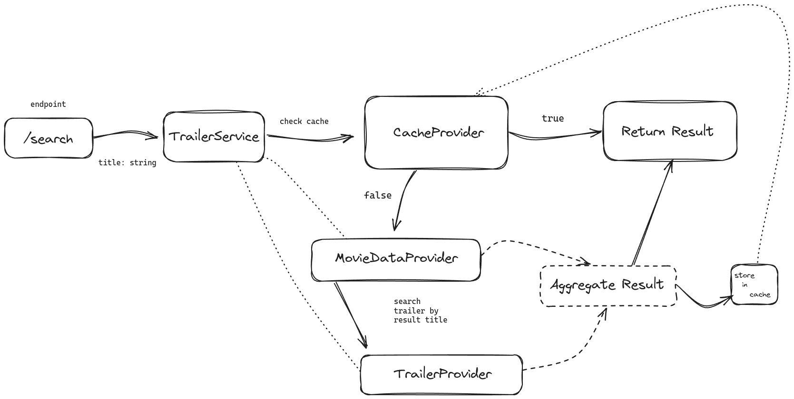
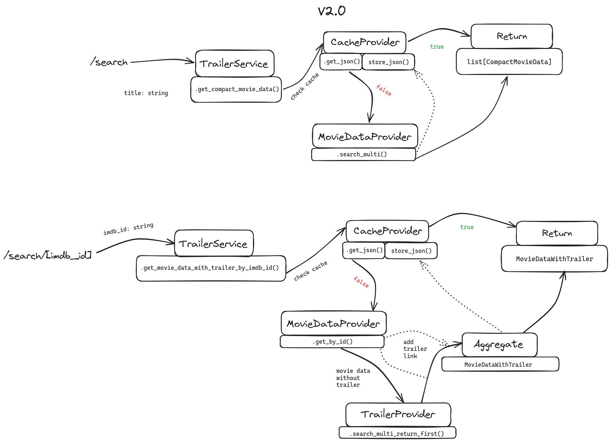
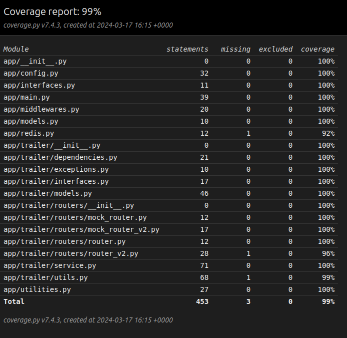

# Backend assessment
## General information

For the assessment I have been tasked to create an API that allows clients to fetch movie trailers with detailed information. The data is fetched from two API's:

- OMDB api (https://www.omdbapi.com/)
- Youtube data api (https://developers.google.com/youtube/v3)

The result is cached in the backend, and also on the client using cache headers.

### Tech stack:
#### Backend:
For the backend I've used Python 3.11 and Redis.
I've used the following tools/frameworks:
##### FastAPI
An asynchronous framework for creating RestAPI's. FastAPI is relatively new in the scene, but gained popularity quickly. It uses Pydantic for data validation and relies heavily on type hinting, even though Python is not a static typed language. Using type hints improves developer experience, catching bugs up front.
##### Pydantic
Built into FastAPI. It allows easy data-validation and serialization with enforced typing.
##### HTTPX
Asynchronous HTTP client 
##### Pytest
THE framework of choice used in my unit and integration tests.

#### Frontend:
For the frontend I've used the Typescript and the react.js library together with Chakra UI ran on Node.JS. 
I'm far from a frontend expert, but enough to get a quick prototype going.

#### Docker
I've used docker compose v2 to spin up containers for my backend, frontend, and the redis backend.

## Install
The docker-compose.yml file is located in the root folder, to build and spin up the containers:

    docker compose up -d --build

Getting the redis image and building the fastapi image is fast, the frontend can take some time (~ 2min).
I've commented out the volumes for fastapi and frontend, so any change made in the code will NOT be reflected instantly. If for some reason you need/want to make changes to the code. Uncomment the volumes in the services. If the frontend service volume is uncommented, you will need to install the node modules locally using:

    npm i
   

## Use:

### Backend
The backend is bound on port: 8000.
FastAPI has automattic swagger and redoc documentation. To visit, navigate to:

Swagger/OpenAPI:

    http://localhost:8000/docs
 
 The endpoints are well documented.

### Frontend
The frontend is bound on port: 3000
The backend has a middleware to add CORS headers, these are only allowed on: localhost:3000.
To use the frontend, you need to run and visit the software on your own device that is able to call from 'localhost', else it will fail.

On the index page there will be two buttons, one for the actual api fetching from real external datasources. The other calling 'mock' data from in-memory data.

### !!!
The youtube data API key gets depleted relatively fast. 

## Design
My approach to this assignment is how I tackle software in general for the last couple of months. 

I'm a big fan of the TestDrivenDevelopment approach, so most of my code is fully tested using the Pytest framework. Writing tests before writing the actual code enforces me to think of what the actual problem  I'm solving and what data will result from it. 
Typically, when I write tests after coding, I often find myself unable to test certain aspects of my software due to excessive coupling and code that carries too many responsibilities.

But before I write any tests or code, I design my software on 'paper' first. Writing down in actual words what my code needs to do, write pseudo code or make flow charts. 

The API has two versions, v1 and v2.
My flow and approach for v1 was as follows:

This got the job done. But wasn't efficient. When searching for a movie that returned more then 1 trailer, the response time could get into the 10/20 seconds, which in my opinion, is a horrible user experience.

I went back to the drawing board and came up with the following design:

This approach creates two endpoint:

- ./search?title={movie_title_here}
- ./search/[imdbID]

The first endpoint will return an array containing imdbID's. This endpoint is fetched first to gather compact data about the movies.
The second endpoint is then called using the imdbID's. 
This approach allows for quicker result, allowing a frontend to render partial results on the frontend, resulting in a better user experience.

### External API's
When a client searches for a movie, the API uses two external API's to get the movie information and the trailer.
#### OMDB (The Open Movie Database)
This API is free to use up until 1000 requests a day. It has two main endpoints, one to search for movies with some compact information and also the IMDB ID.
The IMDB ID is used to call the other endpoint, getting more details about the film.
#### YouTube DATA
This rewards 10.000 credits per API-key, but a search is expensive (100 credits per call). 
The search endpoint is called, appending ' trailer' to the title, to get a list of trailers, returning the first one. (Youtube's search algorithm is quite advanced, the first result is almost always the correct trailer)

(If the key is depleted, in app/config.py, ther are three constants that are named 'YOUTUBE_API_KEY'. Comment the one currently in use, and uncomment a different one ;))

### Caching
#### Redis
Since API calls induce external network latency, and are costly, I have used redis for caching. Every search is cached for 24 hours. The data is not prown to change at a fast rate, so allowing it to cache for 24 hours is, in my opinion, a safe approach.

#### Cache Headers.
I've created custom middleware for FastAPI that injects cache-headers to the response. I've allowed the clients to cache the result for 5 minutes in the browser. The header that gets injected is: Cache-Control: public, max-age=300.

An ETag is also added to the response. For this, I've hashed the response using MD5 and providing that as the ETag. When the client calls the API, and my custom middleware detects 'If-None-Match' in the request header, it will generate a hash of the data requested and evaluate that against the hash received. If the hashes are the same, it will return a '304 - Not Modified' response.

### Mock
For the main trailer service, I have also created a variant I dubbed: 'Mock'. This service mimicks the workings of the original service, but does not call the external API's. 
It has the same endpoints, but introduces an extra query parameter: 'network_lag'. This allows frontend developers to test their UI without calling the external api's, which saves credits. The network_lag parameter allows developers to simulate a real API call by adding some lag to the call, which can be a small unit of 0.1seconds to 10/20/60. The choice is yours.

The Mock variant has a limited amount of movies that can be queried, currently, only the following movies can be queried:

- star wars
- lord of the rings
- indiana jones

## Test coverage:

